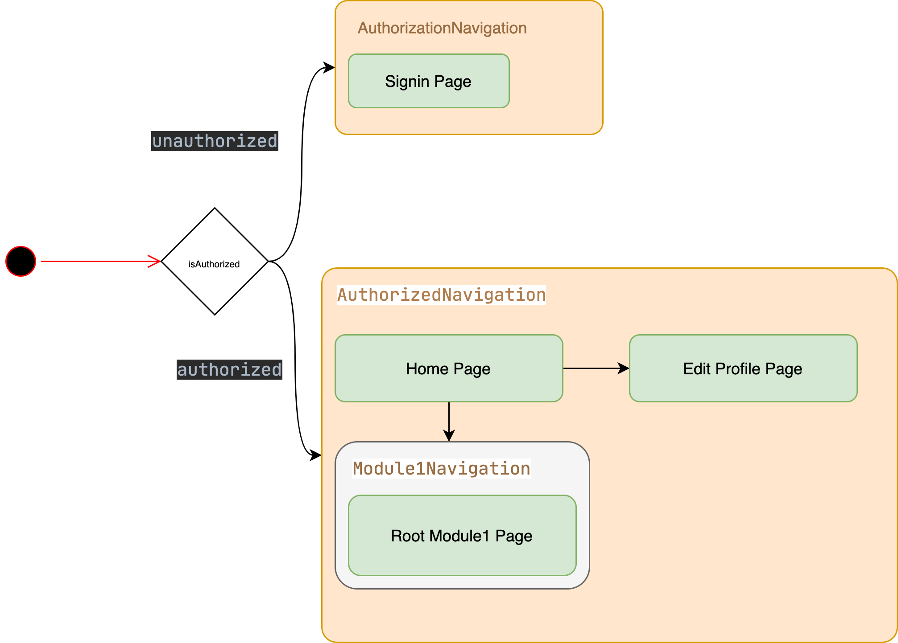

# cubit_app_flow

A Flutter demo for flutter_bloc(Cubit) + Nested Navigation
## Getting Started

## State Management
[***flutter_bloc***](https://pub.dev/packages/flutter_bloc)
#### 1, Auth flow
```
    BlocBuilder<AuthBloc, AuthState>(
        builder: (context, state) {
          return state.when(
              authorized: (user) => AuthorizedNavigation(),
              unauthorized: () => AuthorizationNavigation(),
          );
        },
      buildWhen: (previous, current) {
          return previous.runtimeType != current.runtimeType;
      },
    );
```
#### 2, Account Info
```
class AccountAppBar extends StatelessWidget implements PreferredSizeWidget {
  @override
  Widget build(BuildContext context) {
    return BlocBuilder<AuthBloc, AuthState>(
        builder: (context, state){
          return state.when(
              authorized: (data) {
                return Material(
                ...
                );
              },
              unauthorized: () => SizedBox(),
          );
        },
    );
  }

  @override
  Size get preferredSize => Size.fromHeight(kToolbarHeight);
}
```
## Navigation



